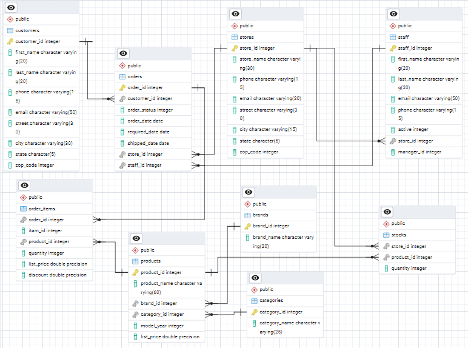

# 🚲 Bike Store SQL Project

This project uses SQL to analyze sales data from a fictional bike store. It involves querying customer information, product categories, revenue analysis, and more.

## 📊 Features

- 📊 **Sales Analysis**: Analyze total sales, average order value, and revenue trends over time.
- 👥 **Customer Insights**: Identify top customers by spending and analyze customer demographics.
- 🛒 **Product Performance**: Determine best-selling products and categories.
- 🏪 **Store Comparison**: Compare performance across multiple store locations.
- 📦 **Inventory Insights**: Check current stock levels and identify slow-moving items.
- 🗓️ **Time-based Trends**: Monthly and quarterly sales breakdowns for better business planning.
- 🔍 **Custom SQL Queries**: Well-organized, reusable SQL queries to answer key business questions.

## 📷 Sample ERD (Entity Relationship Diagram)

