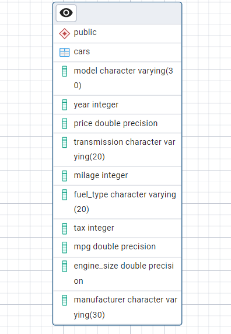

# 🚗 Car Price Analysis Using SQL

This project explores a dataset containing car price and specification details using **SQL queries**. The objective is to derive actionable insights and answer business questions using SQL-based analysis.

---

## 📁 Project Overview

- **Goal**: Analyze car price data to uncover trends, patterns, and business insights.
- **Tools Used**: MySQL / SQL Server / PostgreSQL (any SQL engine)
- **Skills Applied**: SQL querying, filtering, joins, aggregations, sorting, grouping

---

## 🔍 Questions Answered

The following types of questions are solved in this project:

- Which car brands have the highest average prices?
- What are the most common fuel types for expensive cars?
- What is the distribution of car body styles and their average prices?
- Which cars offer the best mileage for their price?
- How do horsepower and engine size impact car pricing?
- What are the top 5 most expensive cars in the dataset?

> 📂 All queries can be found in [`Q&A.sql`](car%20price/Q&A.sql)

---
## Schema Diagram

---
## 🛠️ Technologies Used

- SQL (Structured Query Language)
- CSV/Excel as data source
- Any RDBMS (MySQL, PostgreSQL, SQL Server, SQLite)

---

